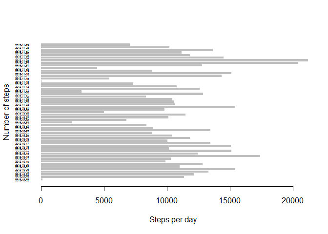
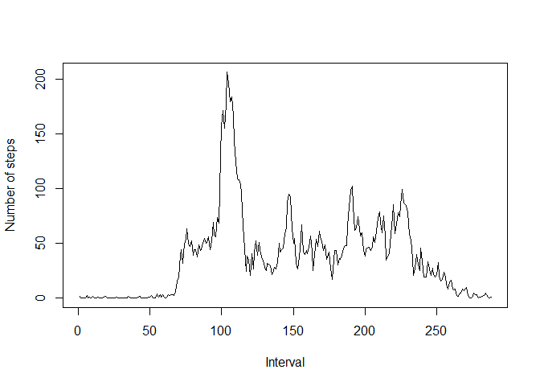
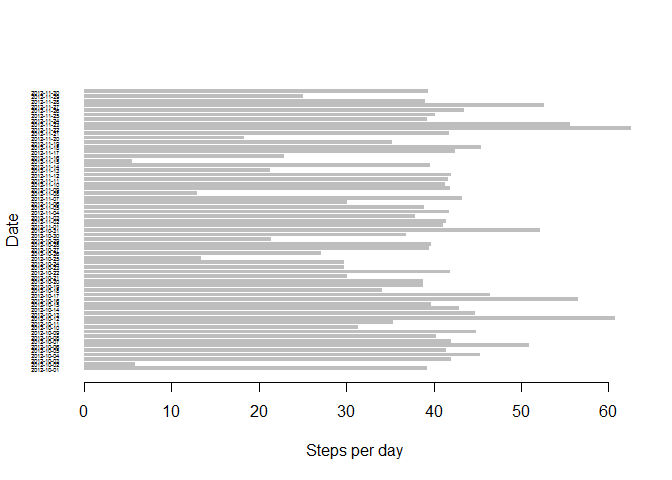
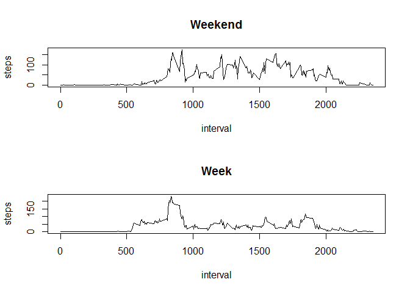

# Reproducible Research: Peer Assessment 1

## Loading and preprocessing the data

```r
fileurl <- "https://d396qusza40orc.cloudfront.net/repdata%2Fdata%2Factivity.zip"
datadir <- "./data"
zipfile <- "projectdataset.zip"
zipfilefullpath <- paste(datadir, "/", zipfile, sep="")
# create data dir if it doesn't exist yet
if(!file.exists(datadir)){dir.create(datadir)}

# download data file if it wasn't downloaded before
if(!file.exists(zipfilefullpath)){
  download.file(fileurl, destfile = zipfilefullpath)
}

## Unzip the dataset
unzip(zipfile = zipfilefullpath, exdir = datadir)

csv <- read.csv(file = "./data/activity.csv", header = TRUE)
acv <- csv

csv$date <- as.Date(csv$date, format = "%Y-%m-%d")

completeCases <- csv[complete.cases(csv),]

tmp <- aggregate(steps ~ date, data=completeCases, FUN = sum)
barplot(tmp$steps, names.arg = tmp$date, border = NA, main = "", xlab = "Steps per day", ylab = "Number of steps", cex.names = 0.4, horiz = TRUE, las=1)
```

<!-- -->
---

**What is mean total number of steps taken per day?**

```r
mean(tmp$steps)
```

```
## [1] 10766.19
```
**What is median total number of steps taken per day?**

```r
median(tmp$steps)
```

```
## [1] 10765
```

## What is the average daily activity pattern?


```r
tmp1 <- aggregate(steps ~ interval, data = csv, FUN = mean)
plot(tmp1$steps, type="l", xlab = "Interval", ylab = "Number of steps")
```

<!-- -->
---
**Which 5-minute interval, on average across all the days in the dataset, contains the maximum number of steps?**

```r
which.max(tmp1$steps)
```

```
## [1] 104
```

## Imputing missing values

**Calculate and report the total number of missing values in the dataset (i.e. the total number of rows with NAs)**

```r
table(complete.cases(csv))
```

```
## 
## FALSE  TRUE 
##  2304 15264
```
*total number of rows with NAs equels 2304*

**Devise a strategy for filling in all of the missing values in the dataset. The strategy does not need to be sophisticated. For example, you could use the mean/median for that day, or the mean for that 5-minute interval, etc.**

```r
#going to fill in the missing data with the mean per interval
```


**Create a new dataset that is equal to the original dataset but with the missing data filled in.**

```r
meanInterval <- aggregate(steps ~ interval, data = csv, FUN = mean)
meanMergedData <- merge(csv, meanInterval, by ="interval")
nas <- is.na(csv$steps)
meanMergedData$steps.x[nas] <- meanMergedData$steps.y[nas]
```

**Make a histogram of the total number of steps taken each day and Calculate and report the mean and median total number of steps taken per day. Do these values differ from the estimates from the first part of the assignment? What is the impact of imputing missing data on the estimates of the total daily number of steps?**

```r
tmp2 <- aggregate(steps.x ~ date, data=meanMergedData, FUN = mean)
barplot(tmp2$steps.x, names.arg = tmp2$date, border = NA, main = "", xlab = "Steps per day", ylab = "Date", cex.names = 0.4, horiz = TRUE, las=1)
```

<!-- -->

```r
mean(tmp2$steps.x)
```

```
## [1] 37.82943
```

```r
median(tmp2$steps.x)
```

```
## [1] 39.73002
```


## Are there differences in activity patterns between weekdays and weekends?

**Create a new factor variable in the dataset with two levels - "weekday" and "weekend" indicating whether a given date is a weekday or weekend day.**


```r
 csv$isWeekend <- as.factor(ifelse(weekdays(csv$date) %in% c("Saturday", "Sunday"), 'Weekend', 'Week'))
```

**Make a panel plot containing a time series plot (i.e. type = "l") of the 5-minute interval (x-axis) and the average number of steps taken, averaged across all weekday days or weekend days (y-axis). See the README file in the GitHub repository to see an example of what this plot should look like using simulated data.**


```r
weekendData <- csv[csv$isWeekend == 'Weekend',]
weekData <- csv[csv$isWeekend == 'Week',]
par(mfrow = c(2,1))
plot(aggregate(steps ~ interval, data = weekendData, FUN = mean), type ='l', main = "Weekend")
plot(aggregate(steps ~ interval, data = weekData, FUN = mean), type ='l', main = "Week")
```

<!-- -->

